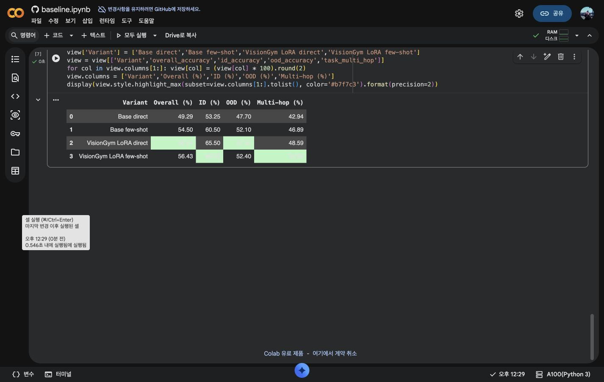

# VLM Reasoning Lab

**Synthetic VLM reasoning benchmark, fine-tuning, and failure-analysis lab with automatic ground truth.**

[Live Demo](https://visiongym.oosu.dev) · [Measured Results](#measured-a100-results) · [Reproduce](#quick-start-cpu-pipeline)

VLM Reasoning Lab measures how Vision-Language Models handle spatial relations, counting, distance, comparison, multi-hop reasoning, and distribution shift. Every image is rendered from programmatically known object metadata, so both the question and ground truth are generated automatically without human labeling.

### Measured headline

On the same 1,400-question benchmark, QLoRA fine-tuning improved **overall accuracy from 49.29% to 58.64%** and **OOD accuracy from 47.70% to 55.90%** versus the Base direct run. Paired analysis shows **243 Base errors fixed, 112 regressions introduced, and +131 net corrected samples**.

The project is intentionally an evaluation and adaptation lab rather than a general-purpose vision application: generate controlled tasks, measure model behavior, fine-tune, and inspect exactly where capability improves or regresses.

## What actually runs

```text
Synthetic Scene Generator
        ↓
Image + Object Metadata
        ↓
Question + Ground Truth
        ↓
Base VLM Inference
        ↓
Evaluation + Failure Analysis
        ↓
LoRA / QLoRA SFT
        ↓
Fine-tuned Evaluation
        ↓
ID vs OOD Comparison
        ↓
Gradio Result Viewer
```

The local CPU pipeline has been smoke-tested end to end for generation, ground-truth evaluation, OOD aggregation, SFT conversion, and reporting. GPU model inference and LoRA training are provided as Colab-ready workflows because model weight downloads and training are intentionally separated from the CPU data pipeline.

## Supported reasoning tasks

| Task | Example |
|---|---|
| Counting | How many yellow objects are above the rectangle? |
| Left / right | Which object is immediately right of the red circle? |
| Above / below | Which object is immediately below the blue triangle? |
| Nearest / farthest | Which object is nearest to the green rectangle? |
| Relative size | Which object is larger, the red circle or blue triangle? |
| Center proximity | Which of two objects is closer to the image center? |
| Relative ordering | Which object is leftmost / rightmost / topmost / bottommost? |
| Between | Which object is between two reference objects? |
| Overlap | Do two objects overlap? |
| Inside / outside | Is one object completely inside another? |
| Multi-hop | Which object is both right of A and above B? |

Scene metadata includes object ID, shape, color, bounding box, center coordinate, semantic size, z-order, split, and OOD condition.

## OOD benchmark

The benchmark is not a random split only. `vlm-reasoning-lab generate` creates a normal ID test split plus explicit OOD conditions:

| OOD condition | Distribution shift |
|---|---|
| `shape` | train/test geometric shapes → unseen star, hexagon, diamond |
| `palette` | red/blue/yellow/green → purple/orange/cyan/pink |
| `count` | 3–5 objects → 6–9 objects |
| `background` | white → dark or noisy background |
| `occlusion` | deliberate object overlap / partial occlusion |

`data/generated/benchmark.jsonl` combines the ID test set and every OOD split so the evaluator can calculate ID accuracy, OOD accuracy, per-condition accuracy, and the OOD generalization gap from one prediction file.

## Quick start: CPU pipeline

Python 3.10+ is supported.

```bash
python3 -m venv .venv
source .venv/bin/activate
pip install -e .

# Requirement from the original project design: one command generates images + QA JSONL.
python generate.py --count 100 --split train --output data/generated

# Or generate the full ID + OOD benchmark from YAML.
vlm-reasoning-lab generate --config configs/dataset.yaml --output data/generated
```

Generated files look like this:

```text
data/generated/
├── train.jsonl
├── validation.jsonl
├── test.jsonl
├── ood_shape.jsonl
├── ood_palette.jsonl
├── ood_count.jsonl
├── ood_background.jsonl
├── ood_occlusion.jsonl
├── benchmark.jsonl
├── manifest.json
├── scenes/
└── images/
```

A tiny reproducible dataset is committed under `data/sample/` so the schema and rendered scenes can be inspected without generating a large dataset.


## VLM baseline

The default Colab model is [`Qwen/Qwen3-VL-2B-Instruct`](https://huggingface.co/Qwen/Qwen3-VL-2B-Instruct). The inference layer is intentionally small: model name, prompt mode, and optional LoRA adapter are CLI arguments, so another Transformers-compatible VLM can be substituted without changing the dataset or evaluator.

```bash
pip install -e '.[vlm]'

vlm-reasoning-lab infer \
  --dataset data/generated/benchmark.jsonl \
  --output outputs/base-direct.jsonl \
  --model Qwen/Qwen3-VL-2B-Instruct \
  --prompt-mode direct \
  --device auto \
  --batch-size 8 \
  --load-in-4bit
```

`--device auto` selects CUDA first, then Apple MPS, then CPU. The `--load-in-4bit` path is intentionally restricted to CUDA because it uses bitsandbytes; omit it for Apple Silicon local smoke tests.

On a large GPU such as an A100, increase `--batch-size` gradually (for example 4 → 8 → 16) while watching VRAM. Every inference output also gets a sibling `.meta.json` containing wall time, effective samples/sec, configured batch size, and peak CUDA VRAM. CUDA OOM during a batch is converted into a clear retry-with-smaller-batch error.

Prompt modes currently supported:

- `direct`
- `json`
- `reasoning`
- `fewshot`

These make it possible to compare prompt changes against fine-tuning on exactly the same images and ground truth.

To avoid loading the model again for every prompt mode, run a prompt sweep:

```bash
vlm-reasoning-lab infer-prompts \
  --dataset data/generated/benchmark.jsonl \
  --output-dir outputs/base-prompts \
  --model Qwen/Qwen3-VL-2B-Instruct \
  --prompt-modes direct reasoning fewshot \
  --device cuda \
  --batch-size 8 \
  --load-in-4bit
```

The model is loaded once and reused for all requested prompt modes, while each mode still gets its own prediction JSONL and runtime metadata file.

## Automatic evaluation

Prediction JSONL needs only `sample_id` and `prediction`; inference also records latency and model metadata.

```bash
vlm-reasoning-lab evaluate \
  --dataset data/generated/benchmark.jsonl \
  --predictions outputs/base-direct.jsonl \
  --output reports/base-direct \
  --model Qwen/Qwen3-VL-2B-Instruct \
  --prompt-mode direct

vlm-reasoning-lab report \
  --metrics reports/base-direct/metrics.json \
  --output reports/base-direct
```

The evaluator produces:

- overall exact-match accuracy
- task-level accuracy
- difficulty-level accuracy
- ID accuracy
- OOD accuracy
- OOD generalization gap
- accuracy by OOD condition
- invalid output rate
- average inference latency when available
- error taxonomy counts
- scored CSV
- up to 100 representative failure records
- task/OOD CSV tables and charts

The answer normalizer accepts short answers, `Answer: ...`, and `{"answer": "..."}` so output formatting can be separated from reasoning failure.

## Failure taxonomy

Errors are automatically grouped into practical categories such as:

- counting error
- spatial inversion
- distance reasoning error
- relation-chain failure
- containment/overlap relation error
- object confusion
- answer format failure

The raw image, question, ground truth, model prediction, task, difficulty, and OOD type remain in `failures.jsonl` for manual inspection.

OOD failures keep their underlying reasoning category as well. For example, a wrong counting answer in `ood_count` remains a `counting_error` and is separately marked as an OOD failure, instead of losing the causal error type under a generic OOD label. Reports also include `task_domain_accuracy.csv`, which makes task × ID/OOD degradation directly inspectable.

## Import Colab experiment results

Colab outputs can be downloaded as a ZIP or copied as a directory and validated/rebuilt locally in one command:

```bash
vlm-reasoning-lab ingest-results \
  --bundle ~/Downloads/visiongym-results.zip \
  --dataset data/generated/benchmark.jsonl \
  --output experiments/a100-baseline \
  --strict
```

The importer discovers prediction JSONL files, checks missing/duplicate/unexpected sample IDs, copies the raw predictions, re-runs the current evaluator, generates per-run charts/reports, creates a cross-run `comparison.csv`, and produces a stratified `failure_gallery.csv`. When multiple runs are present it also selects the base `direct` run and writes `pairwise_summary.csv`, `pairwise_task_delta.csv`, and `pairwise_examples.csv`, so prompt/LoRA runs can be inspected as samples fixed versus samples regressed instead of only comparing aggregate accuracy. This means Colab can focus only on expensive GPU inference/training while the canonical evaluation logic remains reproducible in the repository.

For the checked-in measured runs, a compact analysis bundle can be rebuilt without duplicating raw predictions:

```bash
vlm-reasoning-lab analyze-reports \
  reports/base-direct \
  reports/base-fewshot \
  reports/lora-direct \
  reports/lora-fewshot \
  --output reports/measured
```

The deployed demo loads `reports/measured/` automatically when present.

## LoRA / QLoRA fine-tuning

`configs/training.yaml` defaults to a Colab-friendly QLoRA setup for Qwen3-VL-2B-Instruct.

```bash
pip install -e '.[train]'

vlm-reasoning-lab prepare-sft \
  --dataset data/generated/train.jsonl \
  --output data/generated/train_sft.jsonl

vlm-reasoning-lab train-lora --config configs/training.yaml
```

The training config exposes the experiment knobs that matter for this project:

- `max_samples`: data-scale ablation
- `lora_r`: LoRA rank
- `include_tasks`: task-specific fine-tuning
- `curriculum`: sort easy → hard before training
- learning rate, epochs, accumulation, dropout, 4-bit loading

After training, use the same inference and evaluation pipeline with the adapter:

```bash
vlm-reasoning-lab infer \
  --dataset data/generated/benchmark.jsonl \
  --output outputs/lora-direct.jsonl \
  --model Qwen/Qwen3-VL-2B-Instruct \
  --adapter checkpoints/visiongym-qwen3-vl-2b-lora \
  --prompt-mode direct \
  --load-in-4bit \
  --batch-size 8

vlm-reasoning-lab evaluate \
  --dataset data/generated/benchmark.jsonl \
  --predictions outputs/lora-direct.jsonl \
  --output reports/lora-direct \
  --model Qwen/Qwen3-VL-2B-Instruct+VisionGym-LoRA

vlm-reasoning-lab compare \
  reports/base-direct/metrics.json \
  reports/lora-direct/metrics.json \
  --output reports/base-vs-lora.csv
```

## Colab notebooks

- `notebooks/baseline.ipynb`: generate benchmark → base inference → prompt variants → evaluation
- `notebooks/finetune.ipynb`: QLoRA SFT → adapter inference → base vs fine-tuned comparison

The notebooks intentionally avoid UI polish. CPU work happens before the expensive GPU steps.

## Interactive demo

Install the demo extra and launch Gradio:

```bash
pip install -e '.[demo]'
python app/demo.py --host 0.0.0.0 --port 7860
```

The demo has three surfaces:

1. **Generate Problem** — choose ID/OOD condition and seed, then inspect the generated image, question, ground truth, task, and difficulty.
2. **Result Viewer** — inspect benchmark records and optionally compare precomputed base/fine-tuned predictions.
3. **Experiment Analysis** — inspect the checked-in measured run comparison, paired improvements/regressions, and representative failures. `VISIONGYM_EXPERIMENT_DIR` can override the default bundle.

The repository includes a 24-sample measured showcase under `data/showcase/`. It is loaded by default and covers every benchmark split and reasoning task, with Base few-shot and VisionGym LoRA direct predictions side by side.

Prediction files can be injected without changing code:

```bash
export VISIONGYM_DATASET=data/generated/benchmark.jsonl
export VISIONGYM_BASE_PREDICTIONS=outputs/base-direct.jsonl
export VISIONGYM_FINETUNED_PREDICTIONS=outputs/lora-direct.jsonl
export VISIONGYM_EXPERIMENT_DIR=experiments/a100-baseline
export VISIONGYM_BASE_LABEL="Base direct"
export VISIONGYM_FINETUNED_LABEL="LoRA direct"
```

This makes the deployed demo useful even when a large VLM is not served on the web server itself. When `VISIONGYM_EXPERIMENT_DIR` points at an ingested experiment bundle, the demo also exposes the run comparison, paired improvement/regression table, and representative failure browser.

Live demo: https://visiongym.oosu.dev

## Measured A100 results

These are real measurements from the checked-in 1,400-question benchmark (400 ID + 1,000 OOD), using Qwen3-VL-2B-Instruct in 4-bit mode on a Colab A100. QLoRA used 1,200 training QA, LoRA rank 16, one epoch, and an effective batch size of 8.

| Check | Result |
|---|---:|
| Core tests | 12 passed |
| Public sample scenes | 22 |
| Public sample benchmark QA | 42 |
| ID sample QA | 12 |
| OOD sample QA | 30 |
| Ground-truth/oracle evaluator smoke test | 100% as expected |
| A100 baseline + QLoRA experiment | completed |
| QLoRA training time | 9m 11s |

| Model | Prompt | Overall | ID Accuracy | Multi-hop | OOD Accuracy | OOD Gap | Avg Latency |
|---|---|---:|---:|---:|---:|---:|---:|
| Qwen3-VL-2B Base | direct | 49.29% | 53.25% | 42.94% | 47.70% | 5.55pp | 194.7 ms |
| Qwen3-VL-2B Base | few-shot | 54.50% | 60.50% | 46.89% | 52.10% | 8.40pp | 42.8 ms |
| Qwen3-VL-2B + VLM Reasoning Lab LoRA | direct | **58.64%** | 65.50% | 48.59% | **55.90%** | 9.60pp | 60.0 ms |
| Qwen3-VL-2B + VLM Reasoning Lab LoRA | few-shot | 56.43% | **66.50%** | **50.85%** | 52.40% | 14.10pp | 60.6 ms |

LoRA direct is the representative model because it has the strongest overall and OOD accuracy. Against Base direct, it improves overall accuracy by 9.35 percentage points, ID accuracy by 12.25 points, OOD accuracy by 8.20 points, and multi-hop accuracy by 5.65 points. LoRA few-shot remains the strongest variant for ID and multi-hop accuracy. Full metrics, scored predictions, failures, plots, and comparison CSVs are under `reports/`.

### What the fine-tuning actually changed

The paired 1,400-sample comparison shows that LoRA direct fixed **243** Base-direct mistakes while regressing on **112** previously correct samples, for a net gain of **131** corrected samples. The largest task-level gain was relative ordering, which improved from **15.69% to 56.86% (+41.18pp)**. Multi-hop improved from **42.94% to 48.59% (+5.65pp)**.

The gain was not universal. `between` fell from **35.80% to 32.10% (-3.70pp)**, and the OOD shape split fell from **55.50% to 50.00% (-5.50pp)** even though aggregate OOD accuracy increased. This is the clearest remaining limitation: the LoRA adapter improved the synthetic reasoning domain overall, but it did not uniformly improve every compositional relation or every distribution shift.

The strongest OOD gains for LoRA direct were occlusion (**43.00% → 59.50%**) and background shift (**58.50% → 71.00%**). These measured differences are why the lab keeps paired examples and task/domain breakdowns instead of reporting only a single aggregate score.



## Repository layout

```text
vlm-reasoning-lab/
├── app/
│   └── demo.py
├── configs/
│   ├── dataset.yaml
│   ├── sample.yaml
│   └── training.yaml
├── data/
│   ├── sample/
│   └── showcase/
├── notebooks/
│   ├── baseline.ipynb
│   └── finetune.ipynb
├── src/visiongym/
│   ├── cli.py
│   ├── dataset.py
│   ├── evaluation.py
│   ├── experiments.py
│   ├── geometry.py
│   ├── inference.py
│   ├── question_generator.py
│   ├── renderer.py
│   ├── reporting.py
│   ├── scene_generator.py
│   ├── schema.py
│   └── sft.py
├── reports/
│   ├── base-direct/
│   ├── base-fewshot/
│   ├── lora-direct/
│   ├── lora-fewshot/
│   └── presentation/screenshots/
├── tests/
├── generate.py
└── pyproject.toml
```

## Reproducibility and artifact policy

- Every generator path is seed-driven.
- Large generated datasets are ignored by Git; regenerate them from config.
- Hugging Face caches, model weights, checkpoints, `.env`, and local artifacts are ignored.
- Only the small `data/sample/` fixture is committed.
- No proprietary research notes or private PYLER materials are included in this repository.
