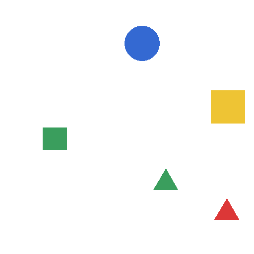

# VisionGym

VisionGym is a synthetic visual reasoning lab for measuring how Vision-Language Models handle spatial relations, counting, distance, comparison, multi-hop reasoning, and distribution shift.

The core idea is simple: every image is rendered from programmatically known object metadata, so the question and ground truth are generated automatically. No human labeling is required.

## What actually runs

```text
Synthetic Scene Generator
        ↓
Image + Object Metadata
        ↓
Question + Ground Truth
        ↓
Base VLM Inference
        ↓
Evaluation + Failure Analysis
        ↓
LoRA / QLoRA SFT
        ↓
Fine-tuned Evaluation
        ↓
ID vs OOD Comparison
        ↓
Gradio Result Viewer
```

The local CPU pipeline has been smoke-tested end to end for generation, ground-truth evaluation, OOD aggregation, SFT conversion, and reporting. GPU model inference and LoRA training are provided as Colab-ready workflows because model weight downloads and training are intentionally separated from the CPU data pipeline.

## Supported reasoning tasks

| Task | Example |
|---|---|
| Counting | How many yellow objects are above the rectangle? |
| Left / right | Which object is immediately right of the red circle? |
| Above / below | Which object is immediately below the blue triangle? |
| Nearest / farthest | Which object is nearest to the green rectangle? |
| Relative size | Which object is larger, the red circle or blue triangle? |
| Center proximity | Which of two objects is closer to the image center? |
| Relative ordering | Which object is leftmost / rightmost / topmost / bottommost? |
| Between | Which object is between two reference objects? |
| Overlap | Do two objects overlap? |
| Inside / outside | Is one object completely inside another? |
| Multi-hop | Which object is both right of A and above B? |

Scene metadata includes object ID, shape, color, bounding box, center coordinate, semantic size, z-order, split, and OOD condition.

## OOD benchmark

The benchmark is not a random split only. `visiongym generate` creates a normal ID test split plus explicit OOD conditions:

| OOD condition | Distribution shift |
|---|---|
| `shape` | train/test geometric shapes → unseen star, hexagon, diamond |
| `palette` | red/blue/yellow/green → purple/orange/cyan/pink |
| `count` | 3–5 objects → 6–9 objects |
| `background` | white → dark or noisy background |
| `occlusion` | deliberate object overlap / partial occlusion |

`data/generated/benchmark.jsonl` combines the ID test set and every OOD split so the evaluator can calculate ID accuracy, OOD accuracy, per-condition accuracy, and the OOD generalization gap from one prediction file.

## Quick start: CPU pipeline

Python 3.10+ is supported.

```bash
python3 -m venv .venv
source .venv/bin/activate
pip install -e .

# Requirement from the original project design: one command generates images + QA JSONL.
python generate.py --count 100 --split train --output data/generated

# Or generate the full ID + OOD benchmark from YAML.
visiongym generate --config configs/dataset.yaml --output data/generated
```

Generated files look like this:

```text
data/generated/
├── train.jsonl
├── validation.jsonl
├── test.jsonl
├── ood_shape.jsonl
├── ood_palette.jsonl
├── ood_count.jsonl
├── ood_background.jsonl
├── ood_occlusion.jsonl
├── benchmark.jsonl
├── manifest.json
├── scenes/
└── images/
```

A tiny reproducible dataset is committed under `data/sample/` so the schema and rendered scenes can be inspected without generating a large dataset.



## VLM baseline

The default Colab model is [`Qwen/Qwen3-VL-2B-Instruct`](https://huggingface.co/Qwen/Qwen3-VL-2B-Instruct). The inference layer is intentionally small: model name, prompt mode, and optional LoRA adapter are CLI arguments, so another Transformers-compatible VLM can be substituted without changing the dataset or evaluator.

```bash
pip install -e '.[vlm]'

visiongym infer \
  --dataset data/generated/benchmark.jsonl \
  --output outputs/base-direct.jsonl \
  --model Qwen/Qwen3-VL-2B-Instruct \
  --prompt-mode direct \
  --device auto \
  --load-in-4bit
```

`--device auto` selects CUDA first, then Apple MPS, then CPU. The `--load-in-4bit` path is intentionally restricted to CUDA because it uses bitsandbytes; omit it for Apple Silicon local smoke tests.

Prompt modes currently supported:

- `direct`
- `json`
- `reasoning`
- `fewshot`

These make it possible to compare prompt changes against fine-tuning on exactly the same images and ground truth.

## Automatic evaluation

Prediction JSONL needs only `sample_id` and `prediction`; inference also records latency and model metadata.

```bash
visiongym evaluate \
  --dataset data/generated/benchmark.jsonl \
  --predictions outputs/base-direct.jsonl \
  --output reports/base-direct \
  --model Qwen/Qwen3-VL-2B-Instruct \
  --prompt-mode direct

visiongym report \
  --metrics reports/base-direct/metrics.json \
  --output reports/base-direct
```

The evaluator produces:

- overall exact-match accuracy
- task-level accuracy
- difficulty-level accuracy
- ID accuracy
- OOD accuracy
- OOD generalization gap
- accuracy by OOD condition
- invalid output rate
- average inference latency when available
- error taxonomy counts
- scored CSV
- up to 100 representative failure records
- task/OOD CSV tables and charts

The answer normalizer accepts short answers, `Answer: ...`, and `{"answer": "..."}` so output formatting can be separated from reasoning failure.

## Failure taxonomy

Errors are automatically grouped into practical categories such as:

- counting error
- spatial inversion
- distance reasoning error
- relation-chain failure
- containment/overlap relation error
- object confusion
- answer format failure
- OOD failure

The raw image, question, ground truth, model prediction, task, difficulty, and OOD type remain in `failures.jsonl` for manual inspection.

## LoRA / QLoRA fine-tuning

`configs/training.yaml` defaults to a Colab-friendly QLoRA setup for Qwen3-VL-2B-Instruct.

```bash
pip install -e '.[train]'

visiongym prepare-sft \
  --dataset data/generated/train.jsonl \
  --output data/generated/train_sft.jsonl

visiongym train-lora --config configs/training.yaml
```

The training config exposes the experiment knobs that matter for this project:

- `max_samples`: data-scale ablation
- `lora_r`: LoRA rank
- `include_tasks`: task-specific fine-tuning
- `curriculum`: sort easy → hard before training
- learning rate, epochs, accumulation, dropout, 4-bit loading

After training, use the same inference and evaluation pipeline with the adapter:

```bash
visiongym infer \
  --dataset data/generated/benchmark.jsonl \
  --output outputs/lora-direct.jsonl \
  --model Qwen/Qwen3-VL-2B-Instruct \
  --adapter checkpoints/visiongym-qwen3-vl-2b-lora \
  --prompt-mode direct \
  --load-in-4bit

visiongym evaluate \
  --dataset data/generated/benchmark.jsonl \
  --predictions outputs/lora-direct.jsonl \
  --output reports/lora-direct \
  --model Qwen/Qwen3-VL-2B-Instruct+VisionGym-LoRA

visiongym compare \
  reports/base-direct/metrics.json \
  reports/lora-direct/metrics.json \
  --output reports/base-vs-lora.csv
```

## Colab notebooks

- `notebooks/baseline.ipynb`: generate benchmark → base inference → prompt variants → evaluation
- `notebooks/finetune.ipynb`: QLoRA SFT → adapter inference → base vs fine-tuned comparison

The notebooks intentionally avoid UI polish. CPU work happens before the expensive GPU steps.

## Interactive demo

Install the demo extra and launch Gradio:

```bash
pip install -e '.[demo]'
python app/demo.py --host 0.0.0.0 --port 7860
```

The demo has two surfaces:

1. **Generate Problem** — choose ID/OOD condition and seed, then inspect the generated image, question, ground truth, task, and difficulty.
2. **Result Viewer** — inspect benchmark records and optionally compare precomputed base/fine-tuned predictions.

Prediction files can be injected without changing code:

```bash
export VISIONGYM_DATASET=data/generated/benchmark.jsonl
export VISIONGYM_BASE_PREDICTIONS=outputs/base-direct.jsonl
export VISIONGYM_FINETUNED_PREDICTIONS=outputs/lora-direct.jsonl
```

This makes the deployed demo useful even when a large VLM is not served on the web server itself.

Live demo: https://visiongym.oosu.dev

## Current measured status

The repository does **not** invent model metrics. Current checked-in/local verification is:

| Check | Result |
|---|---:|
| Core tests | 5 passed |
| Public sample scenes | 22 |
| Public sample benchmark QA | 42 |
| ID sample QA | 12 |
| OOD sample QA | 30 |
| Ground-truth/oracle evaluator smoke test | 100% as expected |
| Qwen3-VL local benchmark | not recorded yet |
| Qwen3-VL LoRA benchmark | not recorded yet |

The actual portfolio result table should be populated only after running the Colab notebooks:

| Model | Prompt | ID Accuracy | Multi-hop | OOD Accuracy | OOD Gap | Avg Latency |
|---|---|---:|---:|---:|---:|---:|
| Qwen3-VL-2B Base | direct | pending | pending | pending | pending | pending |
| Qwen3-VL-2B Base | best prompt | pending | pending | pending | pending | pending |
| Qwen3-VL-2B + VisionGym LoRA | direct | pending | pending | pending | pending | pending |

## Repository layout

```text
visiongym/
├── app/
│   └── demo.py
├── configs/
│   ├── dataset.yaml
│   ├── sample.yaml
│   └── training.yaml
├── data/
│   └── sample/
├── notebooks/
│   ├── baseline.ipynb
│   └── finetune.ipynb
├── src/visiongym/
│   ├── cli.py
│   ├── dataset.py
│   ├── evaluation.py
│   ├── geometry.py
│   ├── inference.py
│   ├── question_generator.py
│   ├── renderer.py
│   ├── reporting.py
│   ├── scene_generator.py
│   ├── schema.py
│   └── sft.py
├── tests/
├── generate.py
└── pyproject.toml
```

## Reproducibility and artifact policy

- Every generator path is seed-driven.
- Large generated datasets are ignored by Git; regenerate them from config.
- Hugging Face caches, model weights, checkpoints, `.env`, and local artifacts are ignored.
- Only the small `data/sample/` fixture is committed.
- No proprietary research notes or private PYLER materials are included in this repository.

## License

MIT

